# Horoscope Reader

## By: Natalie Abrams (nba28)


I have created a Horoscope reader. Simply input your birthday, and it will print out a horoscope matching your appropriate horoscope sign. 

The goal for this project was to create something I could give to my mom as a gift. She loves horoscopes and I was excited to try lots of different parts that we had yet to use during the semester, and combine them with techniques we learned throughout. 

The system will fully run on an Arudino, with various connected components. 


### Initial Vision

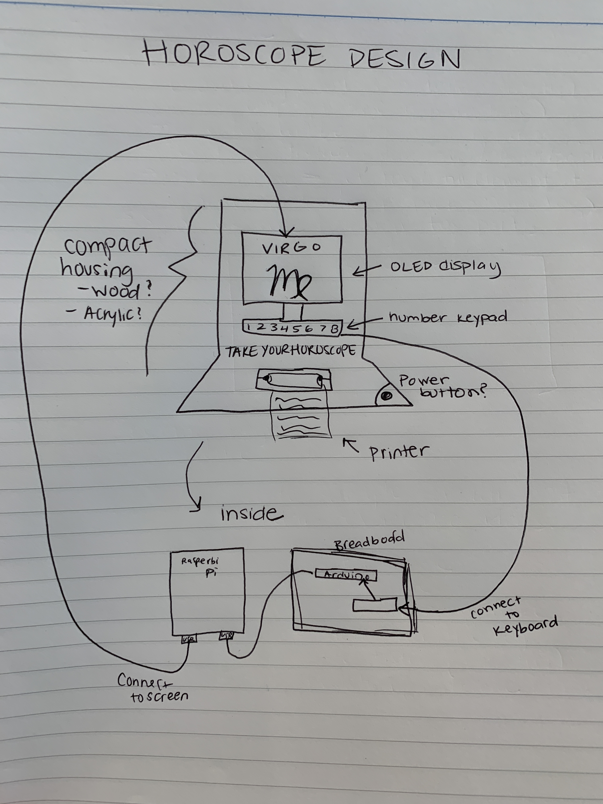


### Paper Prototype

[Initial Project Proposal](./project-proposal.pdf)


The paper prototype demonstrates the look and the feel of the machine.

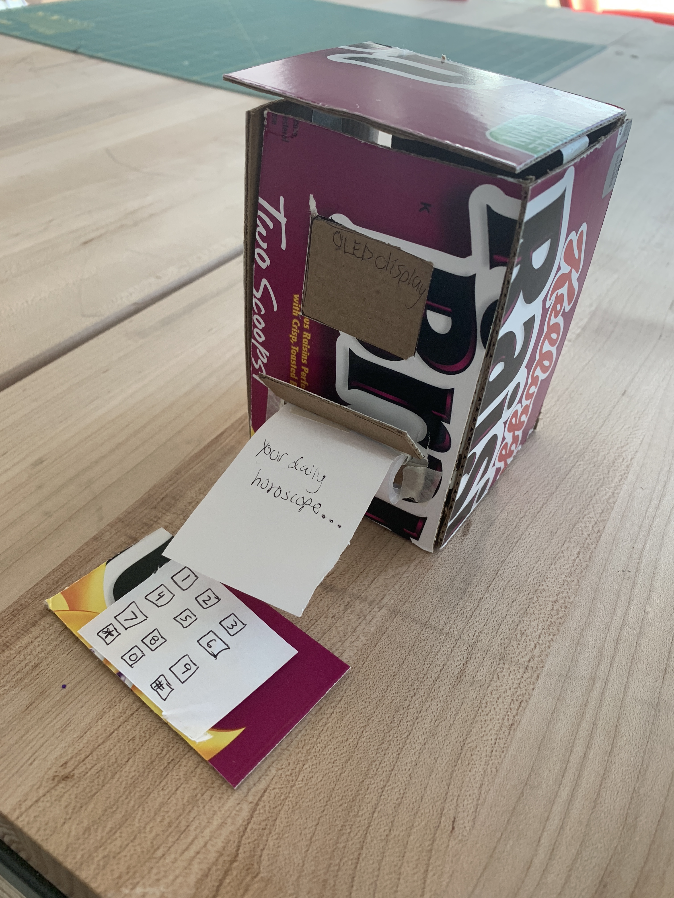


### Verplank Diagram


### Expected Parts

- Arduino
- Keypad (https://www.adafruit.com/product/419)
- OLED display (https://www.adafruit.com/product/1673)
- Thermal Printer (https://www.adafruit.com/product/2753)
- Acrylic (for the exterior box)
- Extra paper for the printer (https://www.adafruit.com/product/2754)


### Interaction Plan

Users will approach the machine and enter their birthday on the keypad followed by the "#" sign. Then on the display, it will show which horoscope matches your birthday and the pritner will print out your horoscope for you to take with you!

### First steps

The first step I took was to get all of the parts working together within the same Arduino code, all connected to the breadboard we were given in class. 

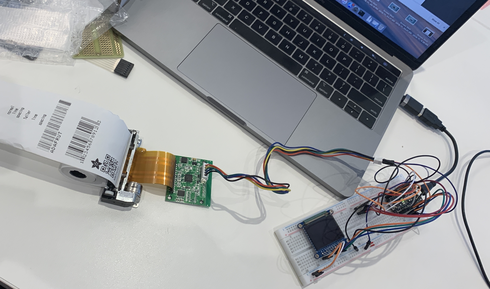

My next step was to transfer those components onto a proto board so that all of the parts would be much more compact, resulting in a better looking outcome and a smaller box. 


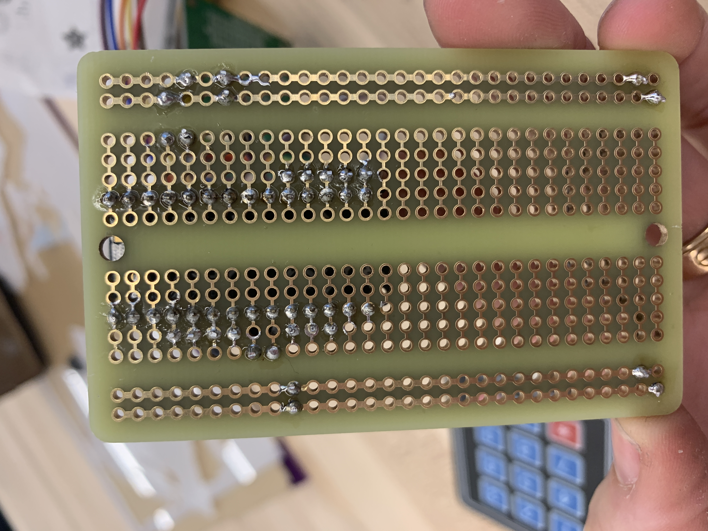


Now that all of the components were soldered together, I wanted to start designing the box to put them in. Here is the first cardboard prototype that I cut on the laser printer. 

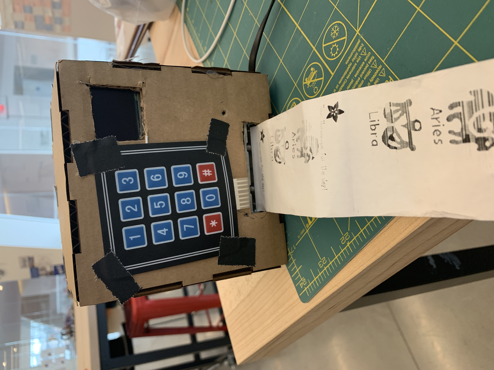
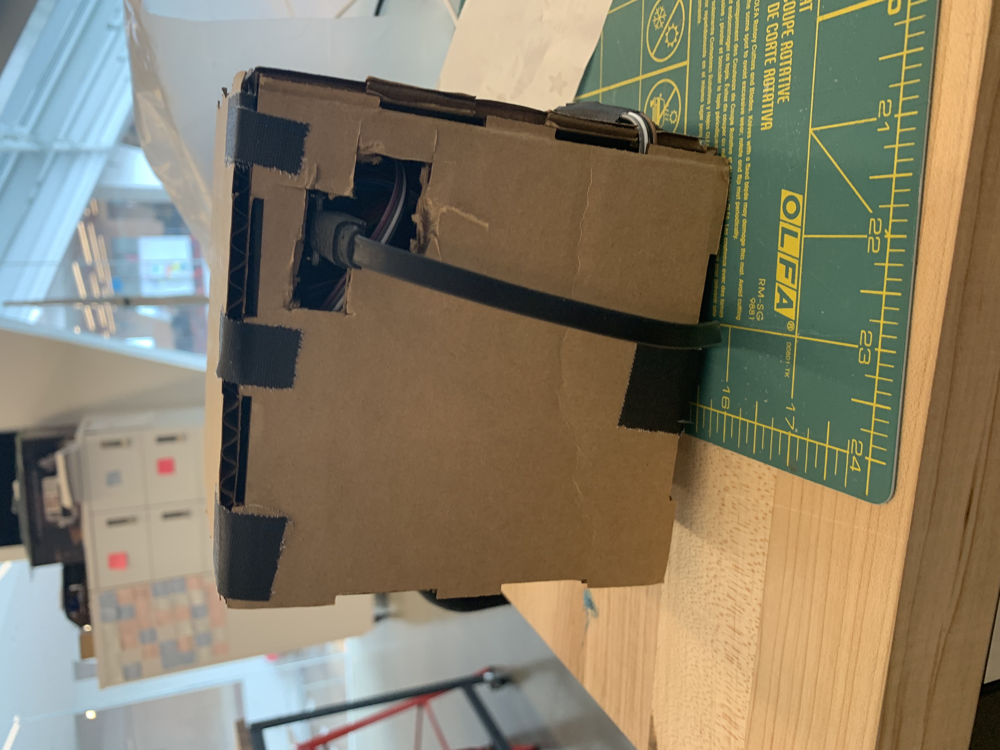

While this worked, I needed to create more accurate dimensions for all the appropriate slots and holes, because the final box was being printed on acrylic. 

Here are the final plans from Adobe Illistrator:

[Illustrator file](./box-nabrams.ai)

[PDF version](./box-pdf.pdf)


### Putting it all together

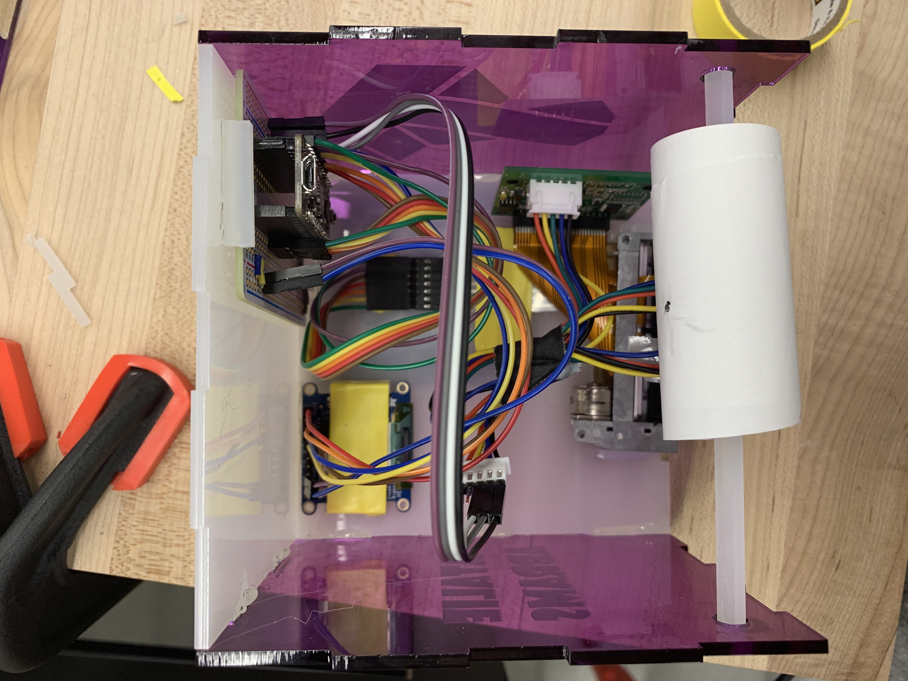

### Final Box Design

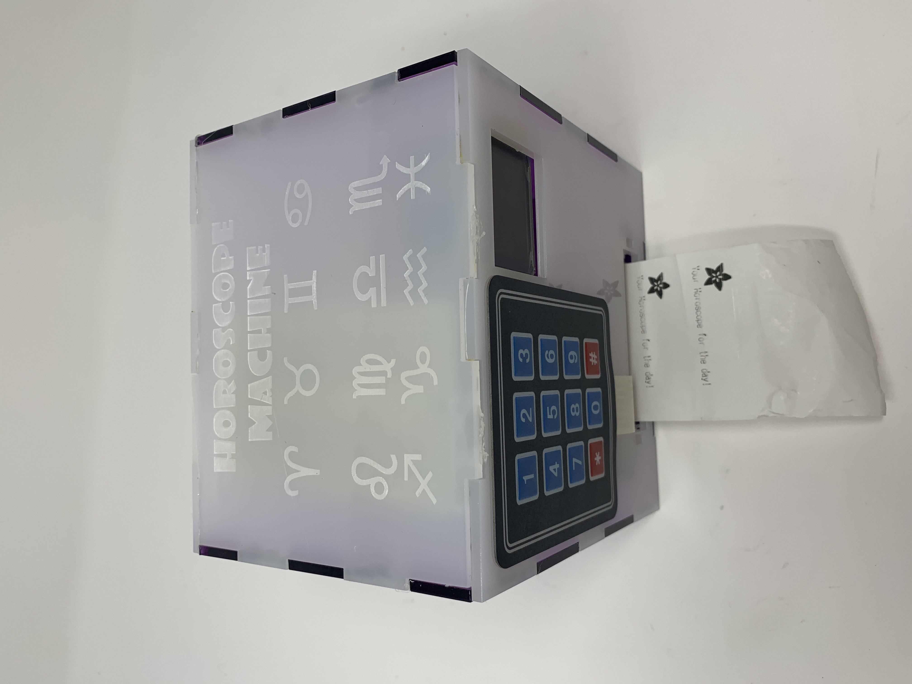
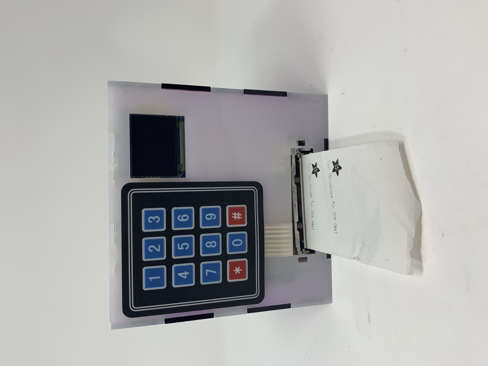
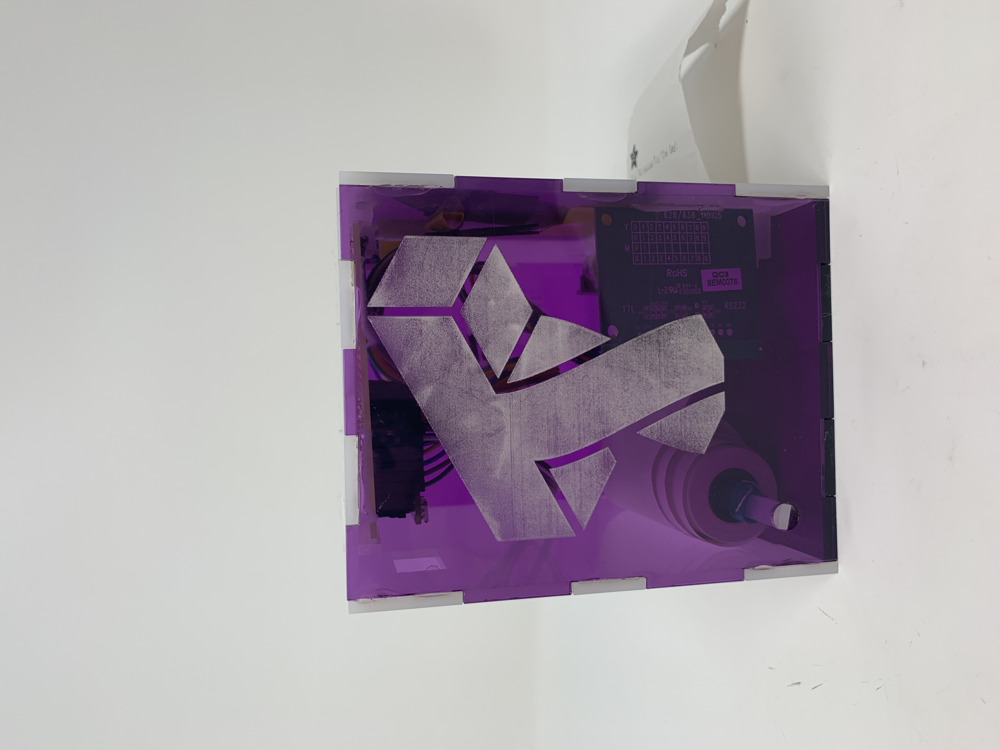
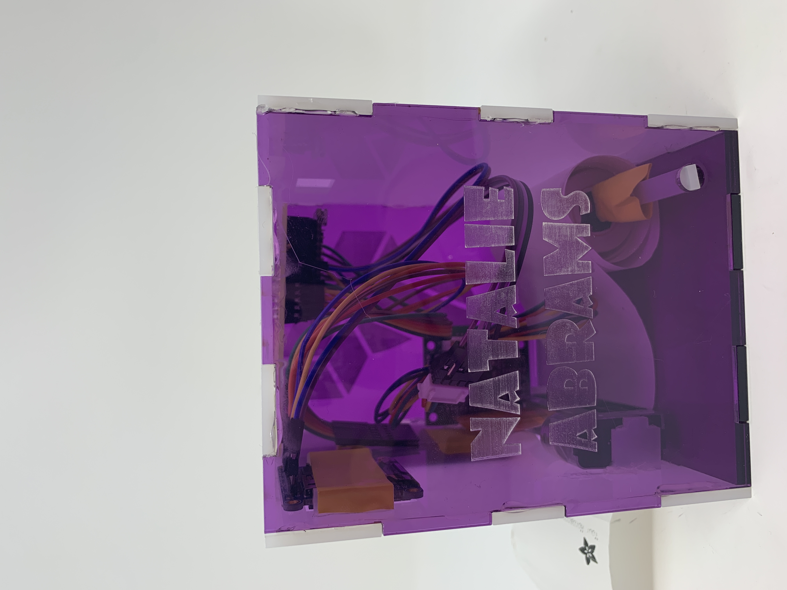


### The code

## General Overview
Initially, I was going to use both the Arduino and Rasberri Pi so that I could pull horoscopes from a Horoscope API I found, allowing for new and unique horoscopes everyday. I was unable to get the API to work with the Pi, so I scaled back my expectations and decided that the printer would print a generic reading for each symbol. 

I also discovered that the Arduino does not have enough memory to store all of the symbols for the horoscopes I wanted to print along with the reading, so I had to do some thinking. I decided that the Libra logo was the most important, because my mom is a Libra, so the rest of the readings print out without a unique symbol. 

## How I made the horoscope logos
I used this program called [processing](https://processing.org/download/). I found images online, then scaled them to the amount of pixels I wanted them to be. Then I used a program called bitmapImageConvert to make the images into bitmap data to be readable by the arduino.

```
// THIS IS NOT ARDUINO CODE!  Runs in Processing IDE (www.processing.org).
// Convert image to C header file suitable for the Adafruit_Thermal library.

void setup() {
  // Select and load image
  selectInput("Select image file to convert:", "processImage");
}

void processImage(File image) {
  String      filename, basename;
  PImage      img;
  PrintWriter output;
  int         pixelNum, byteNum, bytesOnLine = 99,
              x, y, b, rowBytes, totalBytes, lastBit, sum;
  println("Loading image...");
  filename = image.getPath();
  img      = loadImage(image.getPath());

  // Morph filename into output filename and base name for data
  x = filename.lastIndexOf('.');
  if(x > 0) filename = filename.substring(0, x);  // Strip current extension
  x = filename.lastIndexOf('/');
  if(x > 0) basename = filename.substring(x + 1); // Strip path
  else      basename = filename;
  filename += ".h"; // Append '.h' to output filename
  println("Writing output to " + filename);

  // Calculate output size
  rowBytes   = (img.width + 7) / 8;
  totalBytes = rowBytes * img.height;
  // Convert image to B&W, make pixels readable
  img.filter(THRESHOLD);
  img.loadPixels();

  // Open header file for output (NOTE: WILL CLOBBER EXISTING .H FILE, if any)
  output = createWriter(filename); 

  // Write image dimensions and beginning of array
  output.println("#ifndef _" + basename + "_h_");
  output.println("#define _" + basename + "_h_");
  output.println();
  output.println("#define " + basename + "_width  " + img.width);
  output.println("#define " + basename + "_height " + img.height);
  output.println();
  output.print("static const uint8_t PROGMEM " + basename + "_data[] = {");

  // Generate body of array
  for(pixelNum=byteNum=y=0; y=lastBit; b >>= 1) { // Each pixel within block...
        if((img.pixels[pixelNum++] & 1) == 0) sum |= b; // If black pixel, set bit
      }
      if(++bytesOnLine >= 10) { // Wrap nicely
          output.print("\n ");
          bytesOnLine = 0;
      }
      output.format(" 0x%02X", sum); // Write accumulated bits
      if(++byteNum < totalBytes) output.print(',');
    }
  }

  // End array, close file, exit program
  output.println();
  output.println("};");
  output.println();
  output.println("#endif // _" + basename + "_h_");
  output.flush();
  output.close();
  println("Done!");
  exit();
}
```


## Here is the Arduino code that runs the machine:


### Failures

- Orginally I planned to use the rasberri pi but it proved too complex for the time we were given to complete the assignment. I decided to focus on more important things
-I was not able to print the logo for each horoscope sign due to the size capacity of the Ardunio being too small


## Final Video

[Horoscope Reader in Action!](https://youtu.be/6tzJqwW6LNg)


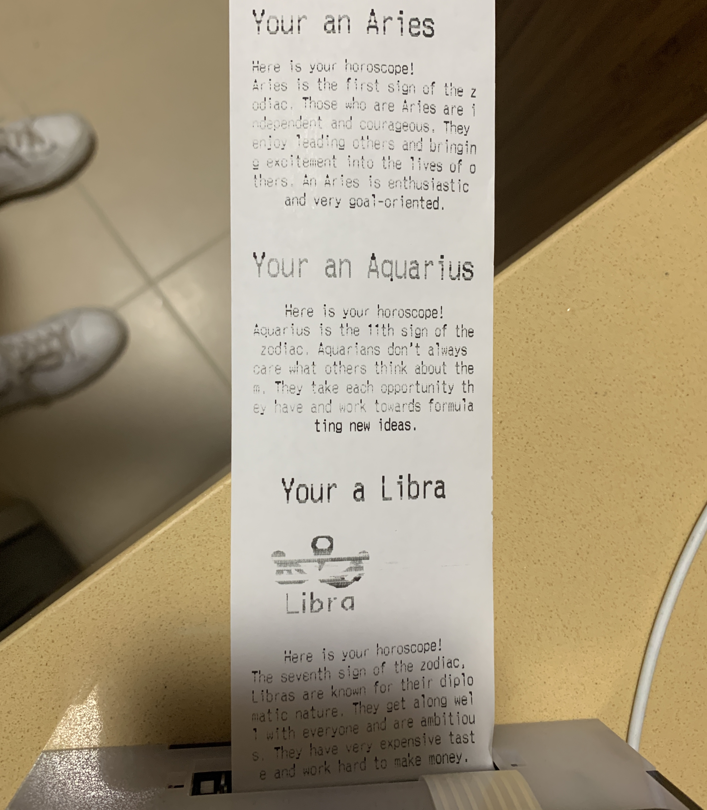
